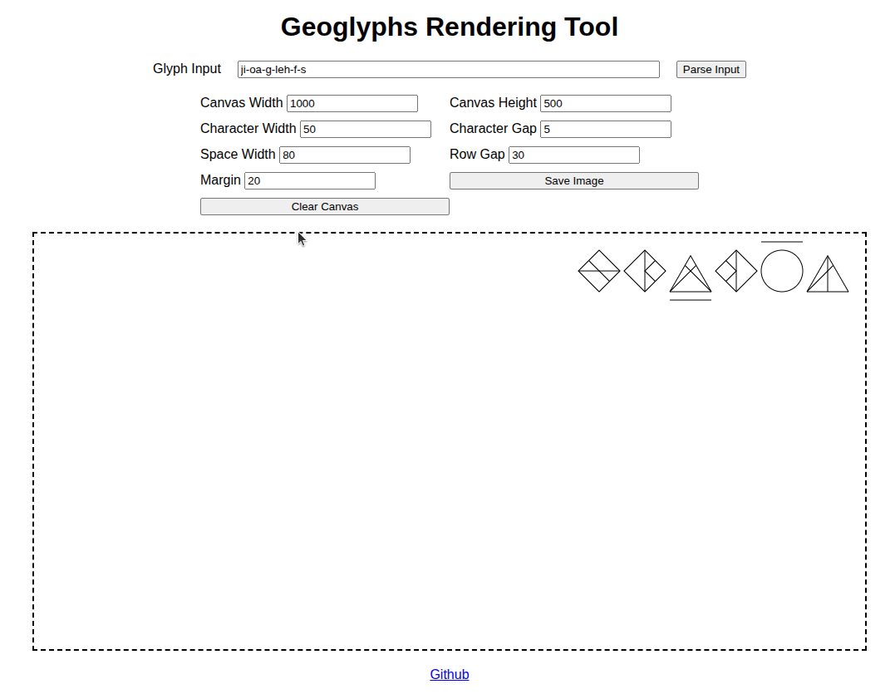
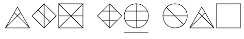
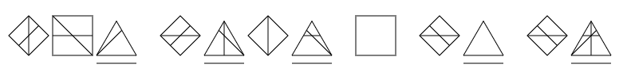
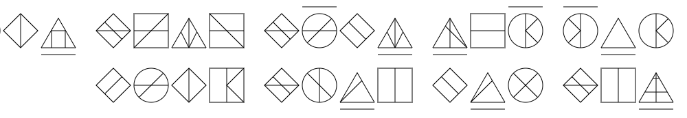

# Geoglyphs Rendering Tool

This is a web-based rendering tool for a writing system I created called Geoglyphs. It was originally going to be a language, but I didn't feel like desiging an entire grammar and lexicon, so it currently remains as a writing system which is applicable to most languages. It is primarily designed with Romance languages in mind. Note that this is currently a proof-of-concept rather than a complete application.



## Language Rules

A character in Geoglyphs, henceforth referred to as a glyph, is comprised of two things: a vowel (determined by the shape of the border) and strokes, which are straight lines that act as constanants. Below is a table of vowels, strokes, and their romanizations (which the application uses for parsing user input).

### Vowels

| Vowel        | Shape               | Sound | Example | Romanization |
| ------------ | ------------------- | ----- | ------- | ------------ |
| Aglyph       | square              | aa    | m**a**ch  | a            |
| Short Aglyph | underlined square   | ah    | c**a**t   | ah           |
| Long Aglyph  | overlined square    | ai    | k**i**te  | ai           |
| Iglyph       | triangle            | ee    | k**ee**p  | i or ee      |
| Short Iglyph | underlined triangle | eh    | m**e**t   | eh           |
| Uglyph       | circle              | oo    | h**oo**t  | u or oo      |
| Short Uglyph | underlined circle   | oh    | d**o**t   | oh           |
| Long Uglyph  | overlined circle    | oa    | c**oa**t  | oa           |
| Short*       | 45° Rotated Square  | n/a   | n/a     | n/a          |

\* - Short isn't technically a vowel, but it represents the absence of a vowel. 

### Constanants

The constants are composed of stroke patterns. There are currently 14 unique strokes which are combined to form constanants. These strokes are always drawn within the border of the of shape.

| Constanant | Stroke Pattern                                          |
| ---------- | ------------------------------------------------------- |
| k          | Vertical                                                |
| z          | Horizontal                                              |
| m          | DiagonalUp                                              |
| n          | DiagonalDown                                            |
| d          | Vertical, Horizontal                                    |
| l          | DiagonalUp, DiagonalDown                                |
| r          | Vertical, DiagonalDown                                  |
| j          | Vertical, DiagonalUp                                    |
| s          | Horizontal, DiagonalDown                                |
| t          | Horizontal, DiagonalUp                                  |
| h          | VerticalOffsetLeft, VerticalOffsetRight, Horizontal     |
| b          | HorizontalOffsetUp, HorizontalOffsetDown, Vertical      |
| w          | Vertical, DiagonalUp, DiagonalDown                      |
| v          | Vertical, DiagonalDownOffsetLeft, DiagonalUpOffsetRight |
| f          | Vertical, DiagonalUpRightHalf, DiagonalDownRightHalf    |
| g          | Vertical, DiagonalUpLeftHalf, DiagonalDownLeftHalf      |
| sh         | Vertical, Horizontal, DiagonalDown                      |
| th         | Vertical, Horizontal, DiagonalUp                        |
| ch         | Horizontal, DiagonalUp, DiagonalDown                    |


### Examples

Note that Geoglyphs is written and read from right to left, since I'm left-handed. Note that the simulator doesn't currently support punctuation, but it's the same as English, just with straight lines instead of curves.

#### Hello World

Sentence: "Hello World"

Geoglyphs Romanization: `heh-loa woh-r-l-d`.


#### Names

Sentence: "Alice Bob and Charlie." 

Geoglyphs Romanization: `a-li-su boh-b a-n-d cha-r-li`.



#### Secret Message

Sentence: "This is a secret message."

Geoglyphs Romanization: `theh-s eh-s a seh-k-reh-t meh-sa-j`.



#### Magic

Sentence: "Fuego Fozare Ventos Servitas Hexus Flickum Bicus Lumen Camerus Factum"

Geoglyphs Romanization: `fu-eh-goa foa-za-reh veh-n-toa-s sa-vi-ta-s heh-k-oh-s f-leh-ka-m beh-ka-s lu-meh-n ka-meh-ru-s fa-k-tu-m`



## Running

To run, ensure that you either have `npm` or `pnpm` installed. Then, run the following commands.

```bash
npm i --save-dev
tsc --build
```

Now, just open `index.html` in your browser.
